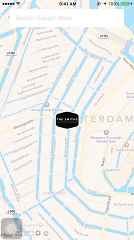

# A text field with a suggestion box [](http://www.appcelerator.com/titanium/) [](http://www.appcelerator.com/alloy/) [](http://choosealicense.com/licenses/apache-2.0/)

An [Alloy](http://appcelerator.com/alloy) [Widget](http://docs.appcelerator.com/titanium/latest/#!/guide/Alloy_Widgets) to create an search field with suggestion box like [Google Maps](https://itunes.apple.com/us/app/google-maps/id585027354?mt=8) application. Furthermore, it is easy to add auto complete a form function as well.

* Source code: [](https://github.com/bduyng/ts.suggestionfield/tree/master)
* Test app: [](https://github.com/bduyng/ts.suggestionfield/tree/test)

## Preview


Or download a [release](https://github.com/bduyng/ts.suggestionfield/releases), extract it to your app's `app/widgets/ts.suggestionfield` folder and add the dependency to your `config.json`:

{
	..
	"dependencies": {
		"ts.suggestionfield": "*"
		..
	}
}

## Use it

Feel free to modify if need.

**index.js**
```javascript
function onPictureTaken(e) {
    console.log(e.image); // the taken photo
}
```

## Changelog

* 1.0.0 Initial version
 
[](http://wearesmiths.com)
